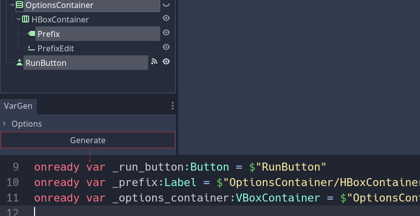

# godot-vargen

This is a simple code generation Godot plugin, which generates `onready var <node_name>: <node_type> = $"<node_path>` declarations for each selected node.

    

# Installation

1. Download this repository and add its `addons` contents to your `addons` project folder.
2. Activate VarGen in Project > Project Settings > Plugins

# Usage

1. Once activated, look for VarGen dock with a button (bottom-right dock slot by default). 
2. Select one or more nodes in you scene explorer. 
3. Press the vargen button.

The script will create an `onready var` statement for each selected node, and insert them into the root node's script. Check the output for errors if nothing happens.

# Important

- ⚠️ This script modifies actual script files on the filesystem, unsaved changes might be lost.
- ⚠️ This script uses an undocumented API to reload scripts in the editor.

# Credits

- 🎨 [icon_GUI_tree_arrow_right.svg](https://github.com/godotengine/godot/blob/3.4.4-stable/editor/icons/icon_GUI_tree_arrow_right.svg) and [icon_GUI_tree_arrow_down.svg](https://github.com/godotengine/godot/blob/3.4.4-stable/editor/icons/icon_GUI_tree_arrow_down.svg) from Godot editor sources.
